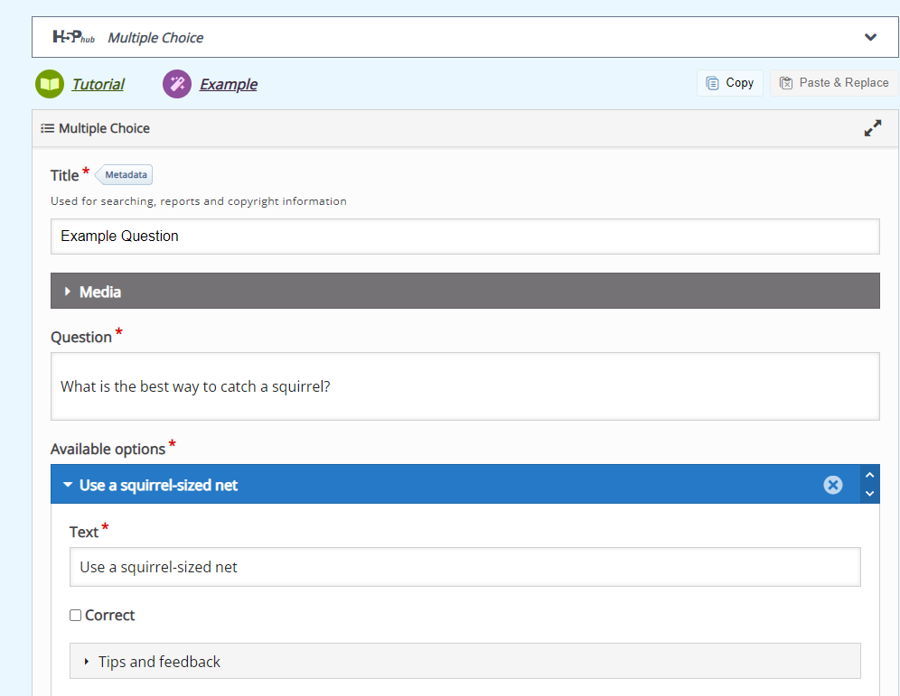
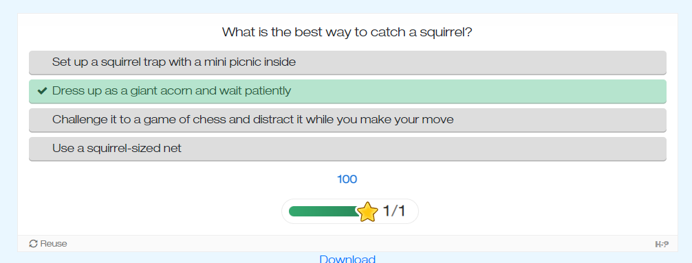

# CS-4820-Telling-Stories

- [CS-4820-Telling-Stories](#cs-4820-telling-stories)
  - [About Us](#about-us)
  - [Documentation](#documentation)
  - [Contributions](#contributions)
  - [Credits](#credits)

## About Us

We are a group of 4th year students currently studying at UPEI. Under the guidance of Prof. David LeBlanc we have been trusted with creating an extension to the commonly used H5P framework which allows non-technical users to register with our application and start creating (and saving) various interactive components. Components such as: multiple choice questions, charts, and even crosswords! You can then integrate these components into any CMS you want (typically moodle or wordpress sites).

**Creating a component:** 

  
 
**Your newly created multiple choice question!** 
 

## Documentation

To view any documentation either visit our github wiki via the above tabs, or click [here](https://github.com/blhutchings/CS-4820-Telling-Stories/wiki).

## Contributions 

**Client:** Dr. William Montelpare  
**Project Lead:** Ben Hutchings -- @blhutchings  
**Tech Lead:** Tasnif Ahmed  
**Test Lead:** Jackson Boulter -- @boulterjackson  
**Version Control/Repo Manager:** Jackson Boulter -- @boulterjackson  
**Frontend Design:** Aditya Agrawal  
**Backend:** Mamnoon Sami  
**Documentation:** Full team effort!

Special thanks to Prof. David LeBlanc for his input and guidance throughout this project.  

## Credits 
This application uses Open Source components. You can find the links to the project(s) we used down below. We acknowledge and are grateful to these developers for their hard work and contributions to open source software.  

**Project:** Lumie Education -- H5P Nodejs Library https://github.com/Lumieducation/H5P-Nodejs-library  

**Project:** H5P Framework -- https://h5p.org/ 
